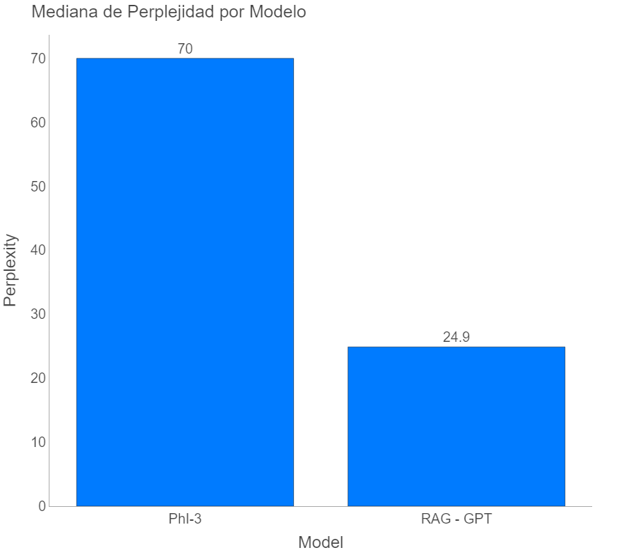

# Generador de Discursos de Texto

## Introducción

En la actualidad, el interés y la acumulación de información en formato de texto, incluyendo redes sociales, documentos, reseñas, opiniones y encuestas, están creciendo exponencialmente. Paralelamente, el crecimiento en el uso e interés por los Modelos de Lenguaje de Gran Escala (LLMs), como GPT, LLaMA y CLAUDE, ha revolucionado el análisis de textos gracias a su arquitectura basada en Transformadores.

Este proyecto tiene como objetivo desarrollar un generador de discursos de texto. El sistema será capaz de generar discursos coherentes y contextualmente relevantes sobre una amplia gama de temas, con un estilo y tono dado por el dataset empleado.

En esta ocasión se van a explorar dos enfoques para la generación de discursos: Fine-Tuning y Retrieval Augmented Generation (RAG).

## Dataset

Para conformar la base de datos, se realizó el scraping de alrededor de 1200 discursos de diversos temas, todos provenientes de la misma fuente: las conocidas conferencias TED. Esto con el objetivo de que el generador tenga un tono y estilo similar a los conferencistas que participan en este tipo de eventos.


## Metodología

El proyecto se basa en dos enfoques principales: Fine-Tuning y Retrieval Augmented Generation (RAG). Ambos métodos se implementaron y compararon para determinar su eficacia en la generación de discursos.

## Fine-Tuning


El enfoque de fine-tuning consiste en ajustar un modelo de lenguaje pre-entrenado a un conjunto de datos específico. En este proyecto, se utilizó el modelo [Phi3 Mini-4K](https://huggingface.co/microsoft/Phi-3-mini-4k-instruct) de Microsoft como punto de partida y se ajustó al dataset de discursos de TED.

### Formato del Dataset

Para que el modelo pueda entender y aprender del dataset, el texto de entrada se ha formateado de la siguiente manera:

```
user: 
Crea un discurso al estilo TED-Talk que suene como si fuera dado por un experto en [campo] y que trate sobre [temáticas]

assistant:
[Contenido del discurso]
```

Los campos `[campo]` y `[temáticas]` variarán dependiendo de los datos disponibles de discursos en el dataset.

Para el entrenamiento se definieron los hiperparámetros para optimizar el rendimiento del modelo, teniendo en cuenta las limitaciones de recursos computacionales y la necesidad de un entrenamiento eficiente. Algunos de los hiperparámetros empleados se resumen en la siguiente tabla:

| Hiperparámetro | Valor | Explicación |
|----------------|-------|-------------|
| per_device_train_batch_size | 2 | Número de muestras procesadas simultáneamente por dispositivo. Un valor bajo (2) permite entrenar con recursos de GPU limitados. |
| gradient_accumulation_steps | 8 | Acumula gradientes de varios pasos antes de actualizar los pesos. Ayuda a simular batches más grandes sin aumentar el uso de memoria. |
| learning_rate | 1e-4 | Tasa de aprendizaje. Un valor de 0.0001 es típico para fine-tuning, balanceando la velocidad de aprendizaje y la estabilidad. |
| num_train_epochs | 5 | Número de veces que el modelo pasa por todo el dataset durante el entrenamiento. |
| optim | "adamw_bnb_8bit" | Optimizador AdamW con cuantización de 8 bits, que reduce el uso de memoria manteniendo el rendimiento. |
| lr_scheduler_type | "linear" | Disminuye linealmente la tasa de aprendizaje durante el entrenamiento, lo que ayuda a la convergencia. |

Para llevar a cabo el entrenamiento de este modelo, es necesario contar con un equipo que cumpla con los siguientes requerimientos:

- **Memoria del Sistema (RAM)**: Se requiere un mínimo de 32 GB de RAM del sistema.
- **Memoria de GPU**: Es necesaria una GPU con al menos 40 GB de memoria dedicada.
- **Espacio en Disco**: Asegúrese de disponer de al menos 201 GB de espacio libre en disco.

**Pérdida durante el entrenamiento**


Como se puede apreciar en el gráfico, la pérdida disminuye rápidamente durante las primeras épocas, especialmente en la primera donde cae de 1.8 a aproximadamente 0.7. Posteriormente, se observan caídas abruptas al inicio de las épocas 2 y 3, seguidas de una estabilización gradual. Finalmente, la pérdida converge alrededor de 0.1 en las épocas 4 y 5.

## Retrieval Augmented Generation (RAG)


A diferencia de los métodos tradicionales de fine-tuning, RAG no requiere la generación de un nuevo modelo de lenguaje. En su lugar, utiliza un modelo pre-entrenado en combinación con una base de datos vectorial, donde se almacena la información de la cual se realizará la recuperación. En nuestro caso específico, esta información consiste en los discursos de TED.

Como se ilustra en la figura anterior, la arquitectura RAG implementada en este proyecto se compone de los siguientes elementos clave:

1. **Base de Datos Vectorial**: Se ha empleado Pinecone, un servicio de indexación y búsqueda de vectores de alta velocidad. Pinecone permite realizar búsquedas de vectores similares en tiempo real, lo que es crucial para la eficiencia del sistema RAG.
2. **Modelo de Embedding**: Para la vectorización del texto, se utilizó el modelo de embedding LLAMA3.1. Este modelo pre-entrenado convierte el texto en representaciones vectoriales densas, capturando efectivamente la semántica y el contexto de las palabras.
3. **Cálculo de Similitud**: La distancia coseno se empleó como métrica para calcular la similitud entre los vectores de texto. Esta medida es particularmente efectiva para comparar la orientación de vectores en espacios de alta dimensionalidad.
4. **Recuperación de Información**: El sistema se configuró para recuperar los 5 discursos más similares al texto de entrada. Este número se determinó como un equilibrio óptimo entre la diversidad de información y la relevancia.
5. **Filtrado de Resultados**: Se estableció un umbral de similitud de 0.7 para filtrar los resultados. Este umbral asegura que solo se consideren los discursos con una alta relevancia semántica.
6. **Generación Guiada**: Se implementó un sistema de prompting para guiar la generación de texto basada en la información recuperada. Este enfoque permite una generación más contextualizada y precisa.

Para implementar el flujo de trabajo RAG de manera eficiente y escalable, el sistema se basó en la librería LangChain. Esta herramienta de código proporciona una capa de abstracción que simplifica la integración de modelos de lenguaje y bases de datos vectoriales.

Un aspecto crucial de la implementación RAG es el diseño del prompt utilizado para guiar la generación de discursos. A continuación, se presenta el prompt utilizado en este proyecto:

```
Eres un experto en la creación de discursos. 
Utiliza ÚNICAMENTE el contexto proporcionado para crear un discurso convincente y bien estructurado sobre el tema dado.

Contexto:
{context}

Tema del discurso: {question}

Por favor, genera un discurso que:
1. Tenga una introducción atractiva
2. Desarrolle los puntos principales de manera clara y concisa
3. Incluya ejemplos o anécdotas relevantes
4. Termine con una conclusión impactante

Discurso:
```

## Implementación

Para el uso de las herramientas desarrolladas en este proyecto, se ha creado una aplicación basada en Streamlit que permite a los usuarios generar discursos personalizados.


## Resultados
### Ejempos de Discursos Generados
**Fine-Tuning**
```
Prompt: Estimados colegas, hoy nos reunimos para discutir sobre
Discurso generado: Estimados colegas, hoy nos reunimos para discutir sobre la desigualdad y la pobreza a lo largo de la historia, desde las origines hasta la actualidad. Incluye datos y gráficos impactantes que ilustren la situación aún más desfavorable de las personas en las comunidades trabajadoras.
 ¿Podemos atrevernos a ser optimistas? Bueno, la tesis de los mil millones de personas atrapadas en países pobres o en crisis es que mil millón de nosotros viven en comunidad trabajadora,

--------------------------------------------------

Prompt: En este día tan especial, quiero agradecer a todos por
Discurso generado: En este día tan especial, quiero agradecer a todos por venir a celebrar la vida y la cultura de nuestros abuelos. Mi padre me dijo cuando era pequeño: "recuerdan que cuando estamos ausentes, la tierra nos sorprende con lo que trae". Y lo sorpe con el aniversario de la llegada de los primeros colonos en Jamestown, Virginia, en 1607. 
Pero lo más romántico que me ha pasado en línea comenzó como una charla TED en Tierra de Talk que hice en honor a un hombre que no

--------------------------------------------------

Prompt: La situación actual nos presenta desafíos, pero también oportunidades para
Discurso generado: La situación actual nos presenta desafíos, pero también oportunidades para salir de esta situacion. Y voy a intentar ahorrarte tiempo y dinero y lo explicaré en los próximos 18 minutos.
 Voy a hablar sobre la economía, la ética y la psicología detrás del fraude en las grandes corporaciones, explorando por qué las personas eligen comportamientos engañosos y las implicaciones de estas decisiones.
```
**RAG**
```
Prompt: Que trate sobre la importancia de la educación en la sociedad actual
Discursos generado: Queridos amigos y colegas, hoy nos reunimos para reflexionar sobre un pilar fundamental de nuestra sociedad: la educación. En un mundo que avanza a pasos agigantados, donde la tecnología y la creatividad se entrelazan, la educación se erige como la brújula que nos guía hacia un futuro más brillante. Permítanme comenzar con una anécdota que ilustra la esencia de lo que significa aprender y crecer. Recientemente, acompañé a una joven en un viaje a Nueva York. 
Mientras caminábamos, se detuvo en seco al ver un toldo rojo de una tienda de muñecas que había marcado su infancia. Recordó cómo, a los cinco años, su corazón estalló de emoción al descubrir ese lugar. 

--------------------------------------------------

Promt: Que trate sobre el feminismo y la igualdad de género
Discurso:En un mundo donde las voces de las mujeres han sido silenciadas durante demasiado tiempo, es fundamental que nos unamos para crear un futuro donde cada individuo, sin importar su género, tenga las mismas oportunidades y derechos. 
Imaginemos un mundo donde cada niña pueda soñar sin límites, donde cada mujer pueda caminar con la cabeza en alto, y donde cada hombre pueda ser un aliado en esta lucha. 

--------------------------------------------------

Prompt: Que trate sobre la tecnologia y su impacto en la sociedad
Hoy quiero hablarles sobre un tema que nos afecta a todos, un tema que ha transformado nuestras vidas de maneras que a menudo no reconocemos: la tecnología. En un mundo donde la innovación avanza a pasos agigantados, es fundamental reflexionar sobre cómo estas herramientas moldean nuestra sociedad, nuestras interacciones y, en última instancia, nuestra humanidad.
Recientemente, mientras caminaba con una persona muy especial, nos detuvimos frente a un toldo rojo de una tienda de muñecas que evocó en ella recuerdos de su infancia.
```
### Perplexity

La métrica de perplexity se utiliza para evaluar la calidad de los modelos de lenguaje. En términos generales, la perplexity mide cuán bien un modelo de lenguaje puede predecir una secuencia de palabras. Un valor de perplexity más bajo indica que el modelo es mejor para predecir el texto.




Basado en la figura anterior el enfoque RAG logra una mejor capacidad predictiva y coherencia en la generación de texto en comparación con el modelo Phi-3 fine-tuned.
## Conclusiones


- La comparación entre Fine-Tuning y RAG revela que ambos enfoques tienen sus fortalezas: Fine-Tuning ofrece una mayor adaptación al estilo específico de los discursos TED, mientras que RAG proporciona una mayor flexibilidad.
- Los resultados de perplexity sugieren que el modelo fine-tuned logra una buena comprensión del estilo y contenido de los discursos TED, a pesar de ser entrenado con una cantidad "limitada" de datos.
- La seleccion del enfoque debe ser planteada en función de las necesidades específicas del usuario y el contexto de uso. Fine-Tuning es ideal para aplicaciones que requieren un estilo de discurso coherente y específico, mientras que RAG es más adecuado para la generación de discursos más flexibles y contextualizados.
## Referencias

- [Microsoft Phi3 Mini-4K](https://huggingface.co/microsoft/Phi-3-mini-4k-instruct)
- [LLAMA3.1](https://huggingface.co/meta-llama/Meta-Llama-3.1-8B-Instruct)
- [Retrieval-Augmented Generation](https://arxiv.org/pdf/2312.10997)
- [Repositorio en GitHub](https://github.com/balechon/GeneradorDiscursos)
